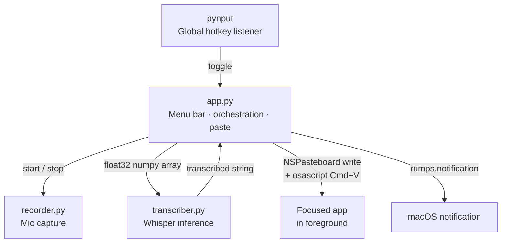
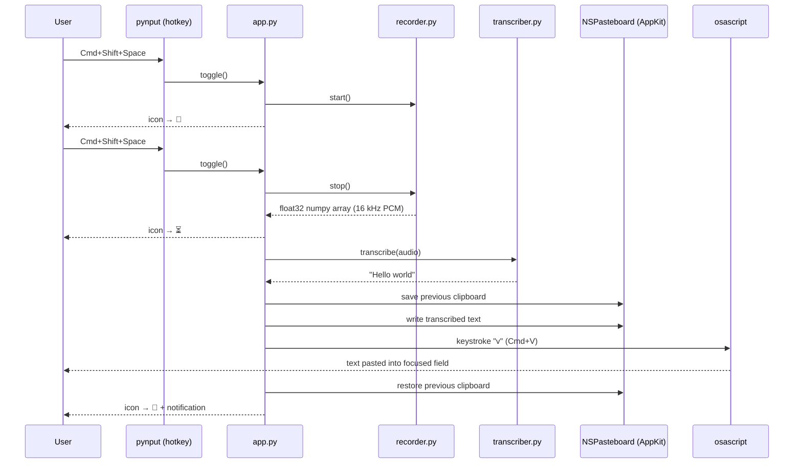
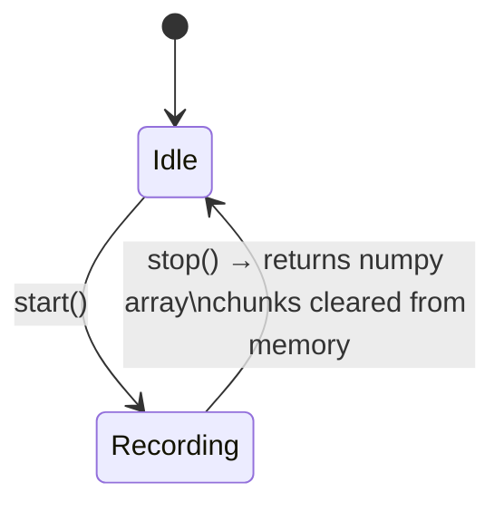

# Free Whisper

A macOS menu bar app that transcribes your voice locally using OpenAI's Whisper model. No cloud, no subscription, no data ever leaves your machine. Press a hotkey, speak, press again — the text appears wherever your cursor is.

## Features

- Runs silently in the macOS menu bar
- Global hotkey (`Cmd+Shift+Space`) works in any app
- 100% local inference — audio never leaves your machine
- Multilingual (auto-detects language)
- Pastes directly into any focused text field
- Clipboard safely restored after every paste via native AppKit API

## Requirements

- macOS
- Python 3.10+

## Installation

```bash
pip install -r requirements.txt
python app.py
```

On first launch, `faster-whisper` downloads the `whisper-tiny` model (~75 MB) and caches it permanently at `~/.cache/huggingface`. Subsequent launches are instant.

## macOS Permissions

macOS will prompt for these automatically on first use:

| Permission | Why |
|---|---|
| **Microphone** | To capture your voice |
| **Accessibility** | For the global hotkey and simulated Cmd+V paste |

To grant manually: **System Settings → Privacy & Security → Accessibility** → add your terminal or Python binary.

## Usage

| Action | Result |
|---|---|
| `Cmd+Shift+Space` | Start recording — icon changes to 🔴 |
| `Cmd+Shift+Space` again | Stop and transcribe — icon changes to ⏳ |
| Click menu bar icon → Toggle Recording | Same as the hotkey |
| Transcription complete | Text pasted at cursor + macOS notification shown — icon returns to 🎤 |

---

## Architecture

Three focused modules communicate through simple function calls and threading primitives.



---

## Data Flow



---

## Module Reference

### `app.py`

The entry point and central coordinator. Inherits from `rumps.App` to live in the macOS menu bar.

**Key responsibilities:**
- Renders the menu bar icon and cycles it through states: `🎤` → `🔴` → `⏳` → `🎤`
- Registers the global hotkey via `pynput` in a background daemon thread
- Guards recording state with a `threading.Lock` to prevent double-triggers
- Pastes text using the native `NSPasteboard` API (no shell string construction) and simulates `Cmd+V` via a fixed `osascript` command

**Paste strategy — why NSPasteboard instead of pyperclip:**

`pyperclip` shells out to `pbcopy`/`pbpaste`, which is slower and adds an extra process. Using `NSPasteboard` directly via PyObjC is the same API macOS apps use internally — faster, no subprocess, and the clipboard type is declared explicitly.

```
1. Read current clipboard via NSPasteboard → save as `prev`
2. Write transcribed text to NSPasteboard
3. Send Cmd+V via osascript (fixed string — never user-controlled)
4. Restore `prev` in a finally block — runs even if paste fails
```

**Error handling:**
- `osascript` is called with `check=True`, `capture_output=True`, `timeout=3` — failures are logged, not silently swallowed
- Only `ValueError` and `AttributeError` are suppressed in the hotkey listener (the two exceptions `pynput` raises on unrecognised key events)

---

### `recorder.py`

Captures raw microphone audio using `sounddevice`.

**Key details:**
- Streams audio in real-time via a non-blocking callback
- Samples at **16 kHz mono float32** — exactly what Whisper expects, no resampling needed
- The `status` parameter in the callback is checked and logged as a warning if non-zero (indicates buffer overflows or device issues)
- Audio chunks are cleared from memory immediately after being consumed in `stop()`

**Recorder state machine:**



---

### `transcriber.py`

Loads and runs the Whisper model using `faster-whisper` (CTranslate2 backend).

**Key details:**
- Model loads in a **background daemon thread** at startup so it is ready before the first recording finishes
- `transcribe()` blocks on a `threading.Event` until the model is loaded, then returns immediately on subsequent calls
- Uses `whisper-tiny` quantized to int8 — fast on CPU, ~75 MB on disk
- Language is auto-detected — no hardcoded locale
- Model integrity is verified by HuggingFace Hub (SHA256 checksums) during the initial download

**Model loading timeline:**

```mermaid
gantt
    title App startup
    dateFormat s
    axisFormat %Ss

    section Main thread
    rumps app starts      : 0, 1s
    Hotkey listener ready : 1s, 1s

    section Background thread
    Download / load model : 0, 4s
    threading.Event set   : 4s, 1s
```

---

## File Structure

```
free_whisper/
├── app.py            # Menu bar app, hotkey, paste logic
├── recorder.py       # Microphone capture
├── transcriber.py    # Whisper inference
├── requirements.txt  # Pinned Python dependencies
└── README.md
```

## Dependencies

| Package | Version range | Purpose |
|---|---|---|
| `faster-whisper` | `>=1.0.0,<2.0.0` | Local Whisper inference via CTranslate2 |
| `sounddevice` | `>=0.4.6,<0.5.0` | Cross-platform audio I/O via PortAudio |
| `numpy` | `>=1.24.0,<3.0.0` | Audio buffer manipulation |
| `pynput` | `>=1.7.6,<2.0.0` | System-wide keyboard hook for global hotkey |
| `rumps` | `>=0.4.0,<1.0.0` | macOS menu bar app framework (wraps AppKit) |
| `pyobjc-framework-Cocoa` | `>=10.0,<12.0` | Native `NSPasteboard` access for safe clipboard handling |

## Security Notes

- Audio is processed entirely in-memory and never written to disk
- Audio chunks are explicitly cleared from memory after transcription
- Transcribed text is written to `NSPasteboard` using the native AppKit API — the `osascript` command is a fixed string and never constructed from user input
- The previous clipboard is always restored in a `finally` block, even if the paste fails
- Dependencies are pinned to compatible version ranges to prevent unexpected updates
- The Whisper model is verified via SHA256 by HuggingFace Hub on first download
